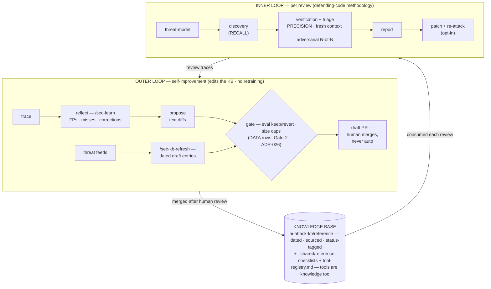

# white-hacker

A **generic, self-improving white-hat security agent** for Claude Code. It reviews any
TypeScript / Go / Python / Java repo (backend, frontend, or AI/LLM framework) for **real,
high-confidence, exploitable** findings, composes into a TL/QA/Dev team workflow, and is
designed to **keep its AI-attack knowledge current** over time.

> **Build state.** The **inner review loop works today**; the **outer self-improvement loop
> is designed and partly built** — its currency arm is **human-triggered today**, not yet
> autonomous. The scheduled refresh mechanism and the trace-capture hooks that would close
> the loop are pending wiring (the gap an internal dogfood RCA surfaced:
> `docs/research/20260610_hades_shai_hulud_pypi.md` §5). "Self-improving" describes the
> architecture and its human-run path — see **Why → Self-improving** below for what runs now.

## The concept: two nested loops

The whole design is **two nested loops over plain-text artifacts behind open interfaces**
(Agent Skills, MCP). It rests on **two foundations** — keep both in view:

1. **Anthropic's `defending-code-reference-harness` methodology** — the **INNER review loop**.
   Threat-model → discovery (recall) → verification (precision; fresh context; adversarial
   N-of-N; PoC-driven false-positive reduction) → triage (dedup by root cause;
   precondition-counted severity; exclusion list) → patch (+ re-attack).
2. **The Self-Improving Agent Architecture** — the **OUTER loop**. No retraining: it edits
   *text behind interfaces* across the Model / Harness / Context surfaces. Trace → reflect →
   propose text diffs → gate (eval keep-or-revert, size caps, identity preservation) → PR.

They nest: **the inner loop *consumes* the knowledge base; the outer loop *edits* it.** The
KB-refresh routine is the input arm that ingests "new ways to hack AI products." Canonical
statement: `docs/ARD.md` ADR-001.



Everything else — *especially* specific scanner tools — is secondary and swappable.

---

## What it is

- **One agent** (`plugins/white-hacker/agents/white-hacker.md`, ADR-009): a senior-security-engineer
  identity + stage dispatch. Reusable three ways — as `/security-review`, a delegated
  subagent, and an agent-team teammate — from a single definition.
- **~12 composable skills** (`plugins/white-hacker/skills/`), one per stage, chained via on-disk
  JSON so each runs standalone, resumes after context exhaustion, and is CI-gateable.
- **A living KB** (`ai-attack-kb/reference/`): dated, source-linked, status-tagged AI-attack
  technique entries, progressive-disclosure loaded only when an LLM/agent/MCP repo is reviewed.

**Artifact chain** (the inner loop's plain-text spine):

```
THREAT_MODEL.md → SCAN-PLAN.json → VULN-FINDINGS.json → TRIAGE.json → SECURITY-REPORT.md → PATCHES/ (opt-in)
```

---

## Why

- **Generic.** No language coupling. `sec-detect` fingerprints the stack from manifest files
  and selects scanners; the same find → triage → report → patch loop survives a language port
  unchanged. Only four things vary per stack (the oracle, PoC format, build/run, in-scope classes).
- **Self-improving.** The outer loop edits text behind open interfaces (Context + Harness
  surfaces), not the weights — cheap, testable, reversible. Every change is a reviewable diff
  behind a deterministic gate (Gate-1: eval keep-or-revert for KB/checklist edits; Gate-2: the
  source+schema DATA gate, ADR-026 — implementation pending — for registry/watchlist entries) and
  size caps; never auto-merged (ADR-004).
  Procedural memory lives as progressive-disclosure skills. The KB-edit lane is built and
  **human-triggered today** (`/sec-kb-refresh`, `/sec-learn` — a human runs them and merges the
  PR); **autonomous** currency is not yet wired — the scheduled refresh mechanism (wh-hxt.12) and
  the trace-capture hook registration (wh-hxt.8) are pending, so the loop does not yet self-fire
  (dogfood RCA: `docs/research/20260610_hades_shai_hulud_pypi.md` §5). The tool registry's
  proposer arm is likewise in progress.
- **AI-aware.** First-class OWASP **LLM (2025)**, **MCP (beta)**, and **Agentic/ASI (2026)**
  coverage — improper output handling (the highest-yield code check), the lethal trifecta,
  MCP token-passthrough, RAG poisoning, excessive agency, unbounded consumption — grounded in
  the living KB, which is **refreshed from authoritative threat feeds via a human-run pass today**
  (autonomous refresh pending wiring — see **Self-improving** above).
- **Disciplined.** Recall and precision are *separate stages* (ADR-008); triage is adversarial
  ("assume false positive"), runs in a fresh context, and the decision-maker sees only
  `{file,line,category,diff}` — context starvation that also defeats prompt injection. The
  agent treats *all* reviewed content as untrusted (Agents Rule of Two) because it is itself
  an injection target.

---

## Quick start

> **Requirements:** Claude Code. Your existing **Pro/Max subscription works as-is — no separate
> `ANTHROPIC_API_KEY` is needed** to install or run the agent, skills, commands, or `/security-review`
> locally. A key (or a Claude Code OAuth token) is only required to run the *optional* headless CI
> action (`ci/security-review.action.yml`) non-interactively in GitHub Actions; the standard test/lint
> CI (`.github/workflows/ci.yml`) needs no credential at all.

The agent has three carriers, one definition.

**1 — Slash command (human entry point)**

```
/security-review                 # review the current working-tree diff
/security-review path/to/subdir  # audit a target path
```

Runs discovery → triage → report and returns **only triaged findings** (never raw discovery
output) plus the `SECURITY-REPORT.md` path. CI gates on `counts.high == 0`. When installed as a
plugin the commands are namespaced — `/white-hacker:security-review` (see **Install & onboarding**
below); the bare form shown here applies under `--plugin-dir` dev mode or user-scope install.

**2 — Delegated subagent**

```
Use the white-hacker subagent to do a security review of the changes on this branch.
```

It runs the inner loop in an isolated context and returns the `TRIAGE.json` summary +
`SECURITY-REPORT.md` path — a summary, not the transcript.

**3 — On a TL / QA / Dev team** (the main use case — a ticket on a side project)

- **Sequential / subagent mode (default):** the tech-lead invokes white-hacker at the review
  phase, *after* Dev implements and QA tests. Lower token cost; non-collaborative parallel review.
- **Team mode (opt-in):** set `CLAUDE_CODE_EXPERIMENTAL_AGENT_TEAMS=1` (Claude Code ≥ v2.1.32).
  TL = lead; spawns Dev / QA / white-hacker teammates with non-overlapping file ownership.
  white-hacker routes findings to the **tech-lead** (not the dev) via `SendMessage`. Reserve
  for work needing adversarial cross-check.

The agent **proposes** fixes; it **does not push or apply** — the write capability is *removed*,
not merely instructed (ADR-010). Patches land in `./PATCHES/` only.

---

## Capability-based tooling (swappable — not the story)

Tools are an **implementation detail behind capability interfaces** (ADR-015). The agent
depends on a *capability* (SAST · SCA · secrets · IaC · AI-redteam), **never a brand**.

- **Floor (always works):** built-in **Read / Grep / Glob** scoped to cwd — a sufficient
  read-only scaffold for any language. **Zero install; the floor alone produces value.**
- **Discover, map, degrade (ADR-003):** the agent detects which tools are installed at
  runtime, maps each to a capability, and falls back to the floor when a capability has no
  tool — it **never blocks**. Degraded findings are marked `tool_assisted:false` with capped
  confidence, and `tools_unavailable` is recorded in the report.
- **Tools are knowledge too.** The registry is part of the self-improving loop: `sec-learn`
  and `sec-kb-refresh` add newly-discovered tools just as they add new attack techniques —
  *there will always be tools we don't know.*

Examples *today* (illustrative, not requirements — the admissible set per ADR-025/027):
OSV-Scanner · Grype (+ Syft) for SCA/images, Checkov + actionlint/zizmor for IaC/CI, gitleaks ·
detect-secrets for secrets, per-language linters (gosec · bandit · ruff · eslint-plugin-security)
for SAST, native low-FP gates (pip-audit · cargo-audit). **Trivy is permanently removed** (TeamPCP
compromise — ADR-027); Opengrep / trufflehog / hadolint fail the License-gate (ADR-025). Whatever
passes the same gates plugs in behind the capability — see
**`plugins/white-hacker/skills/_shared/reference/tool-registry.md`** for the full mapping and the rules
(pin versions, never auto-install from unpinned sources, ADR-006).

Default scanning is **static-analysis-only** (ADR-007): no build / run / install / network.
Execution-verified PoC detonation is an opt-in, sandboxed escalation for high-value HIGHs.

---

## Repo layout

The shipped artifacts live under `plugins/white-hacker/` (payload), separate from this repo's own
thin `.claude/` (dev config). The repo carries an in-repo catalog (`.claude-plugin/marketplace.json`)
used only for **local** plugin registration — there is **no published marketplace listing** (ADR-028).
Identity comes from the agent's `name` field, not the path (ADR-017).

```
white-hacker/                            # repo root (in-repo catalog — local registration only)
├── .claude-plugin/marketplace.json      # catalog — used for LOCAL plugin registration (ADR-028)
├── plugins/white-hacker/                # the shipped plugin PAYLOAD
│   ├── .claude-plugin/plugin.json       # ONLY the manifest lives here
│   ├── agents/white-hacker.md           # the ONE definition (persona, posture, dispatch)
│   ├── commands/security-review.md      # thin /security-review entry point
│   ├── hooks/                           # PreToolUse guardrails + capture + SessionStart-detect
│   └── skills/
│       ├── sec-init/                    # → <repo>/.white-hacker/project-profile.json (onboarding)
│       ├── sec-threat-model/            # → THREAT_MODEL.md (scope + scoring standard)
│       ├── sec-detect/                  # → SCAN-PLAN.json (stack + scanner selection)
│       ├── secrets-scan/  deps-scan/    # → SECRETS.json / DEPS.json
│       ├── sec-vuln-scan/               # discovery — RECALL → VULN-FINDINGS.json
│       ├── ai-llm-review/               # AI/LLM/MCP/Agentic pass (merged into findings)
│       ├── sec-triage/                  # verification + triage — PRECISION → TRIAGE.json
│       ├── sec-report/                  # → SECURITY-REPORT.md + machine JSON
│       ├── sec-patch/                   # opt-in patch ladder → PATCHES/
│       ├── ai-attack-kb/reference/      # living KB (dated, sourced AI-attack entries)
│       ├── sec-learn/  sec-kb-refresh/  # OUTER loop: reflect / refresh feeds
│       └── _shared/reference/           # stable checklists, severity rubric, finding schema,
│                                        #   tool-registry.md (capability → tools)
├── .claude/                             # THIS repo's own dev/dogfood config (thin; NOT shipped)
├── packaging/                           # stdlib manifest/marketplace validator (+ tests)
├── config/                              # custom-scan-instructions + fp-rules examples
├── ci/                                  # security-review.action.yml (pinned model + SHA-pinned)
└── docs/                                # ARD, plan/, research/ (spikes, PoCs, takeaways)
```

---

## Install & onboarding

white-hacker is **installed manually from this repo for now** (ADR-028 — no published marketplace
listing; the plugin *mechanism*, ADR-017, is unchanged: the payload stays a valid, validated Claude
Code plugin, so a published listing later is a docs-only flip). Two manual paths:

### 1 — Install (end users — manual, ADR-028)

**Recommended — the pinned `install.sh` vendor lane (ADR-021).** Run *inside* a target project —
defaults to the **latest release tag**, dogfoods ADR-006 (pins + GPG-verifies, fetches nothing
unpinned, function-wrapped against truncated downloads):

```
# vendor into ./.claude/ (self-contained, committed, CI-runnable) — the default lane
curl -fsSL https://raw.githubusercontent.com/jaigouk/white-hacker/HEAD/install.sh | bash
# or register the pinned clone as a LOCAL plugin instead of vendoring:
curl -fsSL https://raw.githubusercontent.com/jaigouk/white-hacker/HEAD/install.sh | bash -s -- --plugin
```

Works on **macOS or Linux** (detects the host). Pin/override with `--ref <tag>`; preview with
`--dry-run`; CI with `--unattended`. The skills are **stdlib-only** and run isolated via
`uv run --project` — **nothing is installed into your project's Python env**; the only prereq is
`uv`, which the installer **auto-installs (pinned) if missing** (it also provisions Python).
Review-before-run: download, read, run.

**Alternative — register your clone as a local plugin** (uses the in-repo catalog; nothing is
fetched from a published marketplace):

```
git clone https://github.com/jaigouk/white-hacker
/plugin marketplace add ./white-hacker         # register the LOCAL clone as a marketplace
/plugin install white-hacker@white-hacker-marketplace
```

Once installed as a plugin, skills are **namespaced** under the plugin:

```
/white-hacker:security-review            # the review entry point
/white-hacker:sec-init                   # per-project onboarding (below)
```

> (The old hand-copy fallback — copying `plugins/white-hacker/{agents,skills,commands,hooks}/` into
> `~/.claude/` — is unpinned and drifts; use `install.sh` or the local plugin registration instead.)

### 2 — Dev / dogfood loop (no install)

Run the plugin straight from the working tree — no registration, no copy:

```
claude --plugin-dir ./plugins/white-hacker
```

This is how the repo dogfoods its own agent. The repo's own `.claude/` is *dev* config only
(conventions + agent-memory); the **shipped** behavior all comes from `plugins/white-hacker/`.

### 3 — Project onboarding with `/sec-init`

After install, run once per repository you want to review:

```
/white-hacker:sec-init     # (or /sec-init when run via --plugin-dir)
```

`sec-init` **detects the project** — languages, frameworks, which scanners are installed, and
whether the repo has an AI/LLM/MCP/agentic surface — and writes a **gated, project-scope
companion** at `<repo>/.white-hacker/project-profile.json`. The generic agent *consumes* this
profile to specialize a review (pruned scanner registry, the right language appendices, a
threat-model seed, the scoring standard, and the AI-pass flag) **without ever rewriting the
shipped agent identity** (ADR-004): the profile is factual project context, never imperative
instructions, and `posture`/`tools` keys are schema-rejected.

A project-scope **SessionStart hook** can surface that profile as factual context at the start
of each session (the agent still treats injected content as untrusted). Register it at
**project scope, not plugin scope**, per the Claude Code bug
[anthropics/claude-code#16538](https://github.com/anthropics/claude-code/issues/16538).
As an alternative one-time onboarding carrier, the `claude --init-only` **Setup-hook** path can
run the same detection once at launch instead of via the user-invoked skill.

### Security-policy awareness (ADR-018)

Onboarding also detects whether the repo ships a coordinated-disclosure policy. `sec-init`
looks for a `SECURITY.md` in GitHub precedence order (`.github/` → root → `docs/`, first match
wins) plus an RFC 9116 `security.txt`, and records **facts only** — booleans, a closed
reporting-channel enum, the repo-relative path, and `security.txt` expiry — in the project
profile's `security_policy` block. No file-body span is ever stored: the policy is
attacker-influenceable, and the agent is itself an injection target, so it is **untrusted
data, never instructions** (spike-08). The SessionStart hook surfaces these facts as plain
factual context (a malicious `path`/channel is dropped by the F-001 allowlist before it can
reach the model); the recommendation to *add* a policy never rides in here — it lives in the
hygiene-advisory channel below. The same project-scope registration caveat applies
([#16538](https://github.com/anthropics/claude-code/issues/16538)).

At review time the two states diverge:

- **Present** → `sec-policy` parses the existing policy STRUCTURALLY as untrusted data and
  emits a gap report. Declared scope/embargo is used to **annotate** a finding — it **never
  suppresses a real, exploitable HIGH** (a malicious policy could "scope away" a bug). The
  propose path can optionally draft a **merged** `SECURITY.md` that **APPENDS** only the
  missing best-practice sections, preserving every maintainer-declared fact verbatim.
- **Absent** → an informational **hygiene advisory** (not a blocking finding), plus an
  optional best-practice skeleton draft.

Either way, drafts land in `PATCHES/` only and are **human-applied, never pushed** (the same
capability-removed boundary as `sec-patch`; ADR-010/016/018). See
`docs/research/spike-08-security-md-policy-2026-06.md`.

### Dev (`.claude/`) vs ship (`plugins/white-hacker/`)

| Path | Role | Shipped to users? |
|------|------|-------------------|
| `plugins/white-hacker/.claude-plugin/plugin.json` | the plugin **manifest** (only file under `.claude-plugin/`) | yes |
| `plugins/white-hacker/{agents,skills,commands,hooks}/` | the **payload** — component dirs at the **plugin root** | yes |
| `.claude-plugin/marketplace.json` | the **catalog** (this repo == the marketplace) | yes (resolves the source path) |
| `.claude/` | this repo's **dev/dogfood** config (CLAUDE.md conventions + agent-memory) | **no** |
| `CLAUDE.md` (repo root / `.claude/`) | **dev conventions only** — a plugin-root `CLAUDE.md` is **not loaded** by Claude Code, so identity lives in the agent + skills, not a CLAUDE.md | **no** |

Because a plugin-root `CLAUDE.md` is not loaded, the agent's identity and posture are carried
entirely by `agents/white-hacker.md` + the skills (ADR-017). The repo `CLAUDE.md` is dev-only.

Caveat: a subagent's `skills` / `mcpServers` frontmatter does **not** apply when it runs as a
team teammate (teammates load skills/MCP from project + user settings); plugin subagents ignore
`permissionMode` / `mcpServers` / `hooks`. Put operational detail in the spawn prompt and rely
on project-scope skills.

---

## Doc index

| Doc | What it is | Status |
|-----|------------|--------|
| `.claude/CLAUDE.md` | Project conventions + the key concept | Written |
| `plugins/white-hacker/agents/white-hacker.md` | The agent definition — behavior source of truth | Written |
| `docs/ARD.md` | Architecture Decision Records (ADR-001…030) — the *why* | Written |
| `docs/research/` | Spikes (`spike-01..04`), PoCs (`poc-tool-detection`, `poc-trivy-sca`, `poc-floor-review`, `poc-iac-scan`), foundation (`fnd-*`) + self-improvement (`si-*`) takeaways | Written |
| `docs/PRD.md` | Product requirements (FR/NFR + verification criteria) | Written |
| `docs/DDD.md` | Domain model (ubiquitous language, bounded contexts) | Written |
| `docs/ARCHITECTURE.md` | The *what/how* (companion to ARD) | Written |

> This is a **living document** — keep it in sync with the agent definition and the ADRs as
> the rollout progresses. ADRs are append-only; do not contradict them here.
