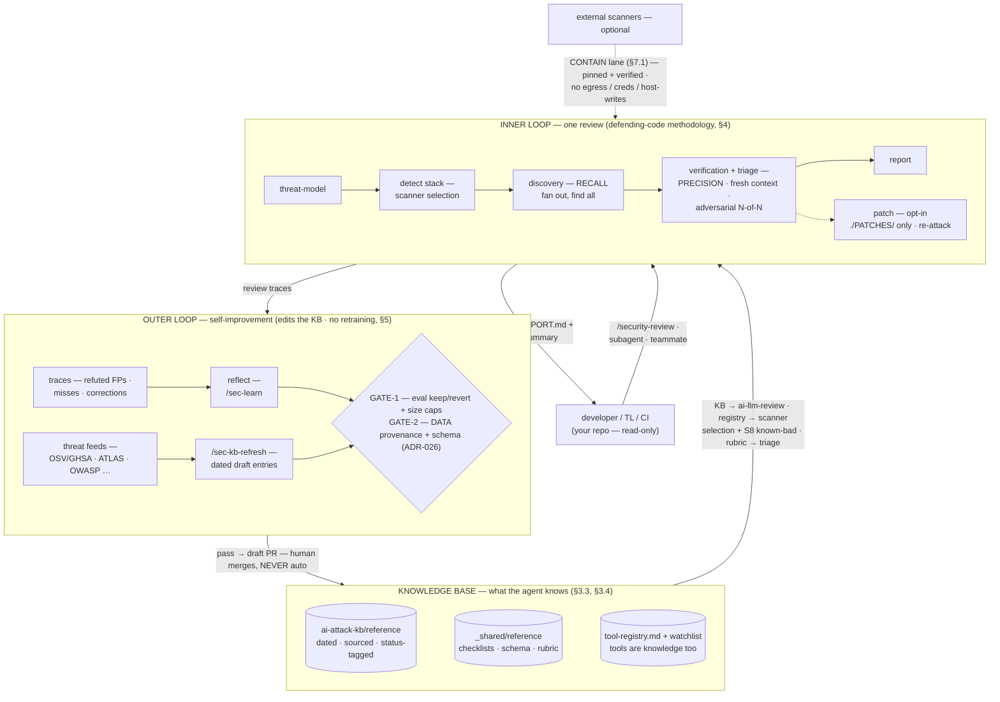
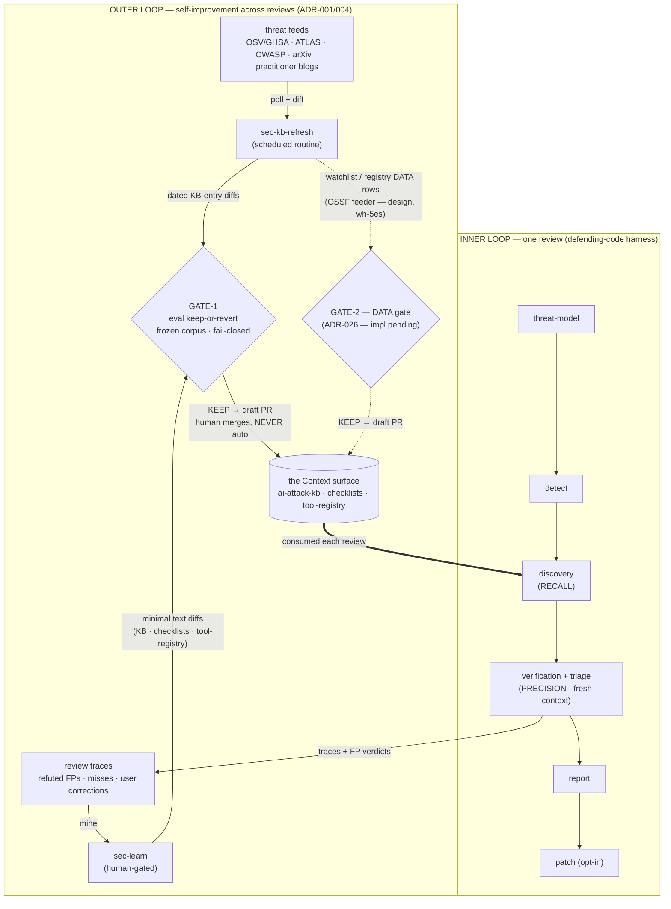
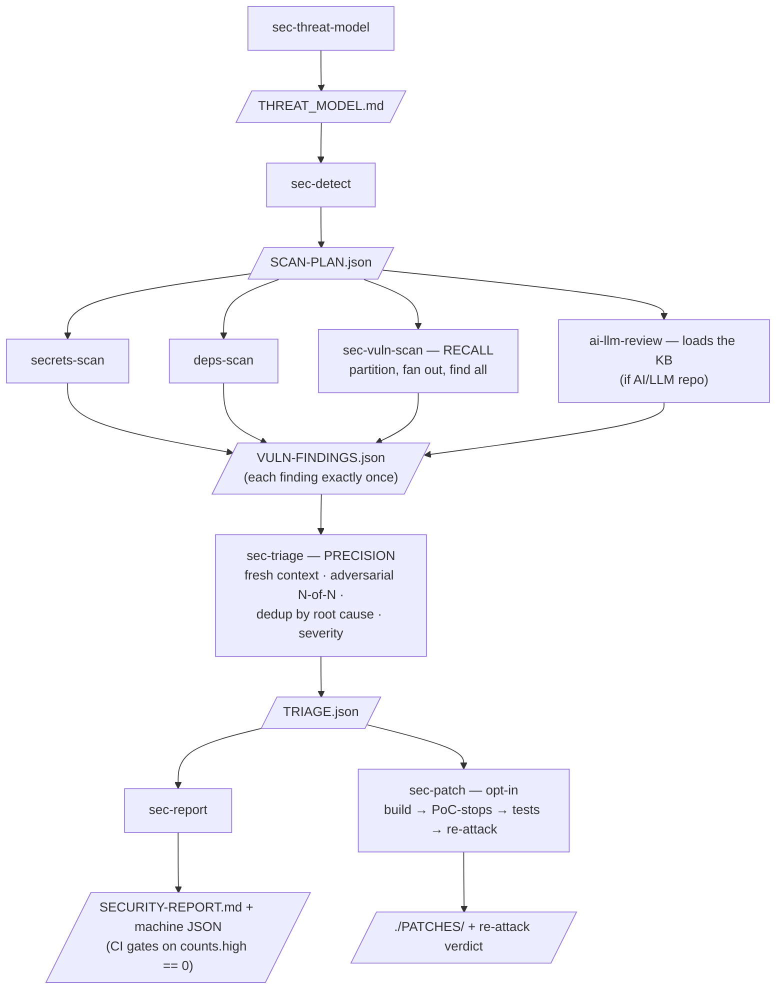
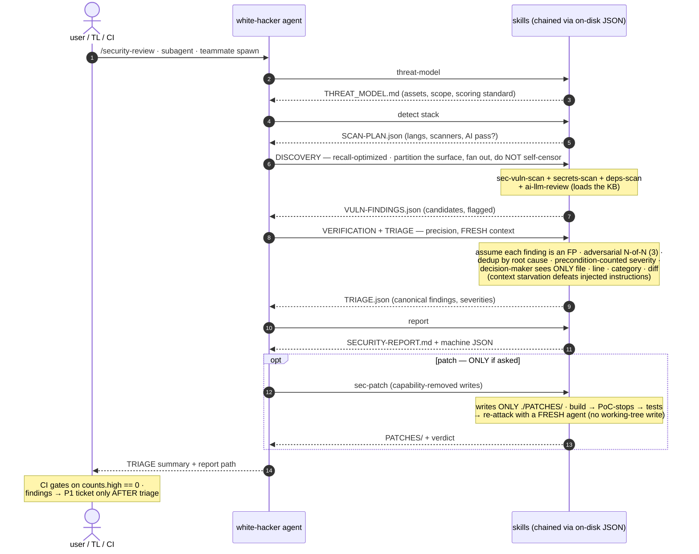
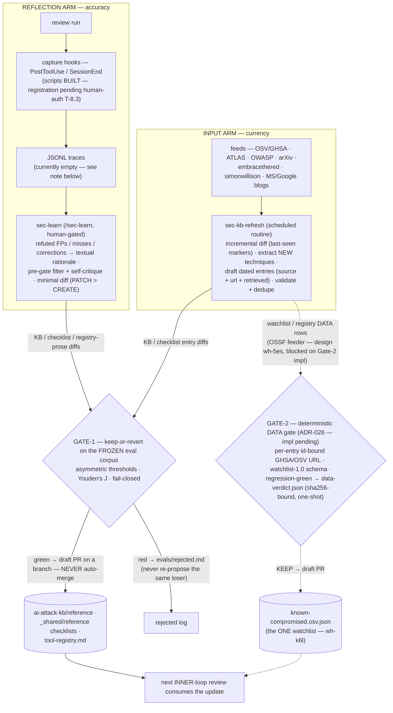
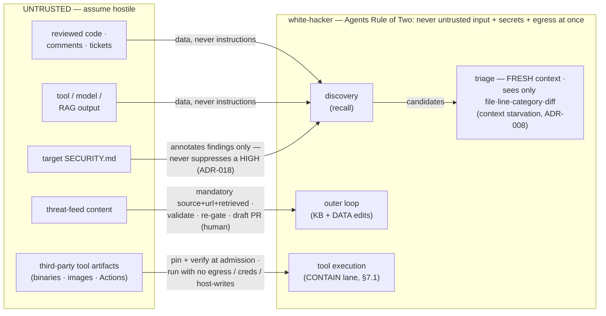
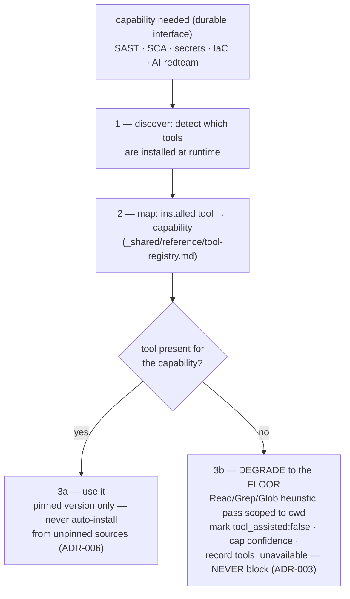
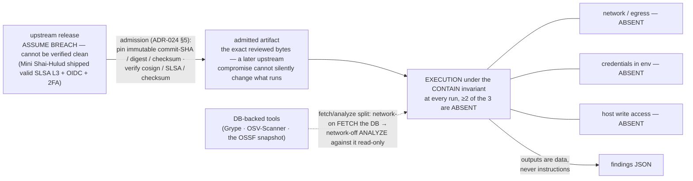
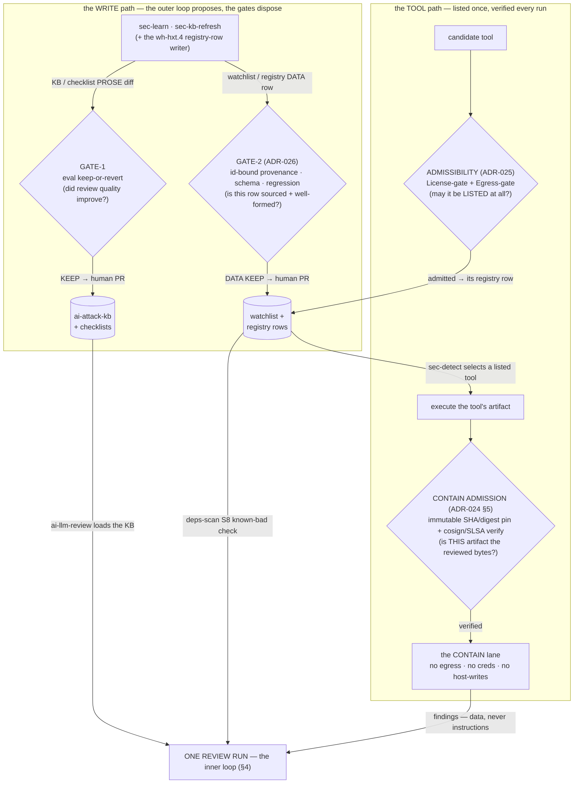

# ARCHITECTURE — white-hacker

> The *what & how* of the white-hacker agent. Companion to `docs/ARD.md` (the *why* —
> the ADRs); planning lives in beads epics/tickets. Living document; maintained, not
> write-once. Last consistency pass: 2026-06-10 (against ADR-024..028 — CONTAIN primary,
> admissibility, Gate-2, the diversified tool set, manual-install posture; diagrams in Mermaid).

white-hacker is a **generic, self-improving white-hat security agent** for Claude Code. The
product is not a scanner — it is **two nested loops over plain-text artifacts behind open
interfaces** (Agent Skills, MCP). Specific tools are a swappable capability layer (ADR-015);
the loops are the whole point.

> **Build state (refreshed 2026-06-10).** The loop machinery is **BUILT**: the agent definition; all
> inner-loop skills (threat-model → detect → secrets/deps/vuln-scan/ai-llm-review → triage → report →
> patch); the `_shared/reference/*` tier + `finding-schema.json`; the living KB with dated entries
> (`ai-attack-kb/reference/*.md`); the outer-loop skills (`sec-learn`, `sec-kb-refresh`); the
> PreToolUse guardrail hooks (wired via `plugins/white-hacker/hooks/hooks.json`); `evals/`
> (frozen corpus + the fail-closed keep-or-revert gate); and the deps-scan sealed lane
> (`docker/deps-scan-sandbox/`). **Decided but not yet implemented** (ADR-024..027 ratified
> 2026-06-09/10): Gate-2 (ADR-026 — validator + write-lane + content-bound one-shot DATA verdict;
> two impl tickets pending), the S8 auto-route bridge (ADR-024 §4 — ARMED-by-config, default-false),
> the watchlist file (wh-k6l — hard-ordered after `gate_data_edit`), the registry rewrite to the
> diversified set (ADR-027 — one shared impl ticket), and the registry-row / feeder proposer arms
> (wh-hxt.4 / wh-5es). **Surfaced by the Hades dogfood RCA** (`docs/research/20260610_hades_shai_hulud_pypi.md`
> §5), DESIGNED but not yet built: **AI-config-file-poisoning detection** (wh-hxt.11 — an `ai-llm-review`
> check that scans a target's `.claude/`/`.cursor`/`.vscode` agent-config for injected exec
> instructions; RC4), **campaign-lineage tracking** (wh-hxt.10 + the `campaign_family` KB field wh-hxt.14;
> RC3), and **first-detector threat feeds** (wh-hxt.9 — Socket / StepSecurity / Phylum into `si-07`; RC2).
> **Still pending human-auth:** capture-hook registration (T-8.3 / wh-hxt.8). Sections below mark these
> explicitly — present tense elsewhere describes what is built.

- **INNER loop** (per review) — Anthropic's `defending-code-reference-harness` methodology:
  threat-model → discovery (recall) → verification (precision) → triage → patch (+re-attack).
- **OUTER loop** (across reviews / on a schedule) — the Self-Improving Agent Architecture:
  trace → reflect → propose text diffs → gate (eval keep-or-revert) → PR. No retraining — all
  durable learning is a reviewable git diff on the Context/Harness surfaces.

The inner loop **consumes** the knowledge base; the outer loop **edits** it (ADR-001).

---

## 0. The system at a glance

One picture before the detail — how a review runs, what it consumes, and how the system improves
itself afterwards. Every box expands in the numbered sections below (§4 the review, §5 the outer
loop, §6/§7.1 the trust model, §7 the tool layer).



---

## 1. The two nested loops



The loops share one substrate: **plain-text files behind stable interfaces.** The inner loop
reads the KB and checklists to do a review; the outer loop rewrites those same files when a
review (or a feed) teaches it something. Because every learning is a text edit behind a
deterministic gate (**Gate-1**, the eval corpus, for KB/checklist edits; **Gate-2**, the
source+schema DATA gate — ADR-026, implementation pending — for registry/watchlist entries), the
system stays auditable, testable, and reversible —
and never needs model retraining (ADR-001, ADR-004).

---

## 2. Learning-surface mapping (Model / Harness / Context → Claude Code primitives)

The Self-Improving Agent Architecture names three learning surfaces. white-hacker maps each to
native Claude Code primitives. **The Model surface is frozen** (we use hosted `claude-opus-4-8`;
there is no fine-tune path, and gradient updates are not reviewable, revertible, or auditable).
All durable learning happens on the Context and Harness surfaces — as git diffs (ADR-004).

| Surface | Holds | Claude Code primitive | Concrete artifact |
|---------|-------|------------------------|-------------------|
| **Context** | *what the agent knows* | Skills + `reference/` (progressive disclosure), per-repo auto-memory | `ai-attack-kb/reference/*.md`, `_shared/reference/*` checklists, `_shared/reference/tool-registry.md`, `~/.claude/projects/<repo>/memory/*` |
| **Harness** | *how it captures signal & enforces guardrails deterministically* | Hooks, `settings.json` permissions, slash commands, scheduled routines | capture hooks (`PostToolUse`/`SessionEnd`), `PreToolUse` guardrails (exit 2 / deny), `/sec-learn` + `/sec-kb-refresh` commands, the cloud kb-refresh routine |
| **Model** | the weights | (frozen — out of scope) | none — retraining rejected (ADR-001) |

Key principle (from the research takeaways): **guardrails belong in the Harness, never in the
Context.** CLAUDE.md and memory are *advisory* — the model may ignore them. Confinement of
self-writes, secret-read blocking, and egress control must be enforced by `PreToolUse` hooks and
`settings.json` `permissions.deny` (deny wins, merges across scopes).

---

## 3. Components

```
white-hacker/
├── .claude/                             # DEV-ONLY scaffolding (dogfooding here; not shipped — §8)
├── plugins/white-hacker/                # the SHIPPED PAYLOAD (ADR-017; dev vs payload split — §8)
│   ├── agents/
│   │   └── white-hacker.md              # THE ONE definition (identity, posture, dispatch)
│   ├── commands/
│   │   └── security-review.md           # thin human entry → discovery+triage+report
│   ├── skills/
│   │   ├── sec-threat-model/            # ┐
│   │   ├── sec-detect/                  # │
│   │   ├── secrets-scan/                # │  INNER-LOOP skills
│   │   ├── deps-scan/                   # │  (review stages, chained via on-disk JSON)
│   │   ├── sec-vuln-scan/               # │  discovery (recall)
│   │   ├── sec-triage/                  # │  verification + triage (precision, fresh ctx)
│   │   ├── ai-llm-review/               # │  AI/LLM/MCP/agentic pass (consumes the KB)
│   │   ├── sec-patch/                   # │  opt-in; writes ONLY to ./PATCHES/
│   │   ├── sec-report/                  # ┘
│   │   ├── ai-attack-kb/                # ── the LIVING KB (Context; consumed by ai-llm-review)
│   │   ├── sec-learn/                   # ┐  OUTER-LOOP skills (self-improvement)
│   │   ├── sec-kb-refresh/              # ┘  feed polling → dated draft entries
│   │   └── _shared/reference/           # stable checklists + tool-registry.md + schema/rubric
│   └── hooks/                           # BUILT: PreToolUse guardrails wired via hooks.json;
│                                        #   capture scripts exist, registration pending human-auth (T-8.3)
├── evals/                               # BUILT: frozen corpus + keep-or-revert gate (fail-closed)
├── docker/deps-scan-sandbox/            # opt-in sealed scan lane (CONTAIN, ADR-024; auto-route decided, default-false — impl pending)
└── docs/                                # ARCHITECTURE.md, ARD.md, DDD.md, plan/, research/
```

### 3.1 The agent — `plugins/white-hacker/agents/white-hacker.md`
One definition: the **senior-security-engineer identity**, the always-on posture (authorized
targets only, read-only by default, treat all reviewed content as untrusted, Agents Rule of Two,
propose-don't-push), and the **stage-dispatch logic** that routes to skills (or runs the stage
inline in a degraded mode if a skill is absent). `tools: Read, Grep, Glob, Bash, SendMessage,
ToolSearch`; `model: opus`. Reusable three ways from one file (ADR-009, ADR-014): as the
`/security-review` command, as a delegated subagent, and as a teammate in a TL/QA/Dev team.

### 3.2 The ~12 skills + artifact chain (ADR-009)
Each stage is a skill; stages are distinguished only by tool-allowlist + prompt and **chain via
on-disk JSON artifacts**, not conversational state — so runs are resumable and CI-gateable.

| Skill | Loop | Role | Reads → Writes |
|-------|------|------|----------------|
| `sec-threat-model` | inner | assets, entry points, trust boundaries, scoring standard | repo, docs, git history → `THREAT_MODEL.md` |
| `sec-detect` | inner | auto-detect langs/frameworks, select scanners, decide AI pass | manifests → `SCAN-PLAN.json` |
| `secrets-scan` | inner | committed-secret pass (fast + verified) | repo → merged into findings |
| `deps-scan` | inner | SCA (native low-FP gates → fallback) | lockfiles → merged into findings |
| `sec-vuln-scan` | inner | **discovery, recall-optimized** (partition then fan out) | repo, `THREAT_MODEL.md`, `SCAN-PLAN.json` → `VULN-FINDINGS.json` |
| `ai-llm-review` | inner | AI/LLM/MCP/agentic checks; **consumes the KB** | repo, KB → `VULN-FINDINGS.json` |
| `sec-triage` | inner | **verification + triage, precision-optimized** (fresh ctx) | `VULN-FINDINGS.json`, `THREAT_MODEL.md` → `TRIAGE.json` |
| `sec-report` | inner | render to human MD + machine JSON, map to OWASP IDs | `TRIAGE.json` → `SECURITY-REPORT.md` |
| `sec-patch` | inner | opt-in patch ladder + re-attack; **capability-removed writes** | `TRIAGE.json` → `PATCHES/` |
| `ai-attack-kb` | outer/Context | the living KB (loaded on demand during `ai-llm-review`) | — |
| `sec-learn` | outer | reflect on FPs/misses/corrections → propose gated diffs | review traces → branch/PR |
| `sec-kb-refresh` | outer | poll feeds → propose dated KB/registry entries | feeds → branch/PR |



Invariants: each finding appears exactly once (duplicates reference a canonical id); `sec-triage`
runs in a **fresh context with no shared history** from discovery (ADR-008); `sec-patch` is
**capability-removed**, not instructed (no `git apply`, writes whitelisted to `./PATCHES/`,
ADR-010).

A target repo's `SECURITY.md`/`security.txt` is detected and consumed as **untrusted data** —
declared scope/embargo only annotate findings and never suppress a real HIGH, and a missing policy
surfaces as an informational hygiene advisory rather than a vuln (ADR-018, spike-08).

**Designed-pending — AI-config-file-poisoning detection (wh-hxt.11).** `ai-llm-review` today models
what the model *reads at runtime* (prompts, tool descriptions, RAG); it does **not** yet scan the
on-disk agent-config that bootstraps execution (`.claude/setup.mjs`, `.cursor/rules/`,
`.github/copilot-instructions.md`, `.vscode/tasks.json`, …) — the exact persistence vector the Hades
PyPI wave used (`docs/research/20260610_hades_shai_hulud_pypi.md` §1, §5 RC4). A check that flags
injected exec instructions in those files is **designed, not built**.

### 3.3 `_shared/reference/` incl. the capability tool-registry
The **stable tier** of the Context surface (yearly cadence): language checklists
(`lang-{go,python,typescript,java}.md`), `ai-llm.md`, `api.md`, `infra.md`, the severity rubric,
exclusion rules, the finding schema, and **`tool-registry.md`** — the capability-layer view of
tools. The registry maps `capability → known tools`, names a zero-install **floor** per
capability, and is designed to be part of the self-improving loop: `sec-learn`/`sec-kb-refresh`
are *intended* to add new tools here as dated diffs, exactly as they add attack techniques
(ADR-015, §7) — the write-lane + the DATA gate are designed (ADR-026); the registry-row
proposer is wh-hxt.4 (unblocked 2026-06-10, not yet built; loop-leverage §3 ADMIT).

### 3.4 The living KB — `plugins/white-hacker/skills/ai-attack-kb/`
The **fast tier** of the Context surface (monthly cadence; ADR-012). Dated, source-linked,
status-tagged (active/archived/deprecated) AI-attack technique entries, one file per
technique-class under `reference/`, loaded by progressive disclosure (≈0 tokens until
`ai-llm-review` triggers it). Each entry fuses Sigma+Semgrep front-matter (typed never-reused
id, `technique_class`, `severity`, `confidence`, `status`, `date`/`modified`/`review_by`,
mandatory `source`+`url`+`retrieved` provenance, `supersedes`, `detections[]`). A blocking
validator refuses to persist an unsourced threat claim. Aging-out moves entries to `archive/`,
never deletes. The KB is **consumed by the inner loop, edited by the outer loop.**

**Designed-pending — campaign-lineage tracking (wh-hxt.10 + the `campaign_family` field wh-hxt.14).**
The schema above is **per-technique static IOCs** with a 90-day `review_by`; it cannot follow a
campaign *family* that re-waves under new package names (Shai-Hulud → Mini → Hades/Miasma). A typed
`campaign_family` front-matter field (wh-hxt.14) plus a re-poll trigger for active families
(wh-hxt.10) is **designed, not built** (`docs/research/20260610_hades_shai_hulud_pypi.md` §5 RC3).

### 3.5 Hooks — capture + PreToolUse guardrails (Harness) — guardrails BUILT+WIRED; capture scripts BUILT, registration pending human-auth (T-8.3)
Two distinct roles (ADR-004):
- **Capture (cheap, every session, ~0 LLM cost):** `PostToolUse`/`PostToolUseFailure` append
  each tool call and each failed exploit to JSONL traces; `SessionEnd`/`Stop` log user
  corrections and nudge "save what you learned"; `SessionStart` injects the freshness/CVE digest
  produced by the refresh routine. This is the raw signal `sec-learn` mines.
- **PreToolUse guardrails (enforced, deny wins):** confine self-writes to KB / `_shared/reference`
  / auto-memory; block reads of `**/.env`, `**/secrets/**`, private keys; block network egress
  except allow-listed feed hosts; block any write to the frozen `evals/` corpus or the gate
  script. These are the structural defenses behind §6 — enforced by the Harness, not advised in
  Context.

### 3.6 The scheduled kb-refresh routine
A **cloud Scheduled Routine** (`/schedule`; Anthropic infra, fresh clone, no local machine; min
cadence hourly) that runs `sec-kb-refresh`: poll authoritative feeds (`docs/research/si-07-threat-feeds.md`),
diff incrementally against last-seen markers, LLM-extract NEW techniques, draft dated entries with
provenance, run validate+dedupe, re-gate against the frozen corpus, and **open a draft PR — never
auto-merge.** Touches the **fast tier only** (the single biggest anti-drift rule). This is the
**input arm** that ingests "new ways to hack AI products," covering *what to look for*
(techniques → KB); the *what to look with* arm (tools → registry, plus the OSV watchlist feeder)
is design intent, not yet wired (loop-leverage audit G1/G5 — wh-5es, wh-hxt.4).

### 3.7 The learn loop — `sec-learn`
The reflective COMMIT tier (human-gated). Runs in a forked context as a curator subagent; harvests
the captured traces; for each refuted FP / miss / correction emits **structured textual rationale**
(GEPA/TextGrad signal, not a pass/fail number); applies a pre-gate filter (seen ≥3 sessions, same
fix, 1–2 sentences, system unchanged) and a self-critique step (generalizable, not overfit); then
proposes a **minimal diff** to the KB, a checklist, or `tool-registry.md` — **defaulting to PATCH
over CREATE** to fight index sprawl. Writes to a branch and opens a PR with evidence; **never
writes the live KB and never merges itself.**

### 3.8 The eval corpus + keep-or-revert gate — BUILT (`evals/`; the gate is fail-closed — no `gate-verdict.json` ⇒ KB writes blocked)
The anti-gaming spine of the outer loop (ADR-004). A **frozen, read-only** corpus of ≥~100 paired
cases — every VULNERABLE case paired with a CLEAN look-alike (the look-alikes drive the
false-positive term that catches FP inflation, the #1 drift mode), plus AI/LLM sinks
(prompt-injection, skill/KB poisoning, excessive agency, insecure output) and real-CVE regression
anchors. The agent **cannot edit the corpus or the gate** (a hook blocks it). Every proposed diff
must pass:

```
HARD REVERT if:  recall_loss > 2pp  OR  FPR_gain > 1pp  OR  any single locked case regresses
KEEP only if:    Youden's J non-inferior  AND ( J improves > 0.01  OR  new sink coverage added )
SECURITY GATE:   severity-weighted recall ≥ baseline  AND  precision ≥ baseline − epsilon
```

The gate is a **guardrail (block regressions), not a benchmark maximizer.** A 3-valued verdict
(Pass/Fail/Inconclusive) from a paired bootstrap (k=3–5 runs/case) tolerates non-determinism. A
**second ratchet** promotes every newly-confirmed true finding into the frozen corpus, so the bar
rises and the KB cannot drift. A weekly full-corpus re-score catches **passive drift** from
model/provider updates, not just agent edits.

---

## 4. Single-review sequence (inner loop)



Default mode is **static-analysis-only**: no build/run/install/network during scanning (ADR-007).
"No PoC" is weak evidence, not proof of safety; execution-verified PoC detonation is an opt-in,
sandboxed escalation.

---

## 5. Self-improvement data flow (outer loop)



Two arms feed the gate layer. The **input arm** keeps the agent *current* (feeds → kb-refresh);
the **reflection arm** keeps the agent *accurate* (review traces → sec-learn). Both produce text
diffs and both end as a human-reviewed PR. KB/checklist edits pass **Gate-1** (the frozen
keep-or-revert eval gate); supply-chain DATA edits (registry/watchlist rows) cannot be scored by
the eval corpus and pass **Gate-2** instead — designed as **ADR-026**: per-entry id-bound GHSA/OSV
provenance · the pinned `watchlist-1.0` schema · regression-green, minting a sha256-content-bound,
one-shot `evals/data-verdict.json` enforced by `gate_data_edit.py` (implementation pending; the
gate-vs-gate split: `docs/research/20260609_supply_chain_loop_leverage.md` §4.1). The updated KB
is consumed by the next inner-loop review — closing the loop. The registry self-updates the same
way the KB does (ADR-015); the write-lane + DATA gate are designed (ADR-026), the registry-row
proposer is wh-hxt.4 (unblocked, not yet built). Note also: the reflection arm's capture hooks are
scripted but not yet registered (pending human-auth, T-8.3), so `sec-learn` currently harvests
zero traces.

The Hades dogfood RCA (`docs/research/20260610_hades_shai_hulud_pypi.md` §5) surfaced two further
**designed-pending** gaps on the **input arm**: (1) the named feeds above lean on OSV/GHSA, which
lag the **first-detectors** (Socket / StepSecurity / Phylum) that break PyPI/npm waves days earlier
— adding them to `si-07` is **wh-hxt.9** (RC2; the 33-vs-37 single-vendor split proves one list is
partial); and (2) a static-IOC KB with a 90-day `review_by` cannot follow a re-waving campaign
*family*, so **campaign-lineage tracking** — a `campaign_family` KB field (wh-hxt.14) plus a re-poll
trigger for active families (wh-hxt.10) — is designed (RC3). Neither is wired yet.

---

## 6. Trust boundaries + agent-as-injection-target defenses

**The reviewer is itself an injection target.** Reviewed code, comments, tickets, model/tool
output, retrieved docs, and even KB text can carry prompt injection (Microsoft's 2026-06-05 PoC
coerced an agent into reading `/proc/self/environ` and exfiltrating `ANTHROPIC_API_KEY`). Trust
boundaries and defenses:



| Boundary | Untrusted side | Defense |
|----------|----------------|---------|
| reviewed content → agent | all code/comments/tickets/model+tool+RAG output, KB text | treat as data, never instructions; posture preamble in the agent definition |
| discovery → triage | finder prose / author rationale | **context starvation** — the decision-maker sees only `{file,line,category,diff}`, never the prose; fresh context, never forked (ADR-008) |
| feeds → KB | feed content (poisonable) | mandatory `source`+`url`+`retrieved`; validate+dedupe; re-gate before proposing; human PR |
| agent → filesystem | self-writes | `PreToolUse` confinement: writes only to KB / `_shared/reference` / auto-memory; never the working tree |
| agent → eval corpus | self-grading | separate identity; hook blocks any agent write to `evals/**` and the gate script |
| agent → network | egress | egress blocked except allow-listed feed hosts (Harness) |
| tool execution → host | third-party scanner binaries / images / Actions (the supply chain) | **CONTAIN** (§7.1, ADR-024): admission pin+verify (immutable SHA/digest/checksum + cosign/SLSA), then execution with ≥2 of {egress · credentials · host-write} absent; fetch/analyze split for DB-backed tools |

**Agents Rule of Two (ADR-001).** Never simultaneously (a) ingest untrusted input, (b) hold
secrets, and (c) have egress. white-hacker holds at most two of the three at any stage: the
discovery/triage stages ingest untrusted code but have no egress and no secrets; the refresh
routine has egress to feeds but ingests no working-tree secrets.

**Context starvation** is the architectural prompt-injection defense (ADR-008): isolate
source-derived text from the decision-making subagent so an injected instruction can pass neither
the author nor the gate.

**Capability-removal, not instruction (ADR-010).** Structural safety beats a sentence a prompt
injection could override. `sec-patch` has *no* working-tree write / `git apply` capability — it
writes only to `./PATCHES/`. The agent *proposes* fixes; humans apply them. The curator that runs
`sec-learn` has no permission to edit `.claude/rules/` security rules or CLAUDE.md (identity
preservation). Removing the capability is the enforcement; the instruction is just documentation.

---

## 7. The capability / degradation layer (tools are swappable; the floor always works)

Tools are an **implementation detail behind capability interfaces** (ADR-015). The agent depends
on a **capability** — SAST · SCA · secrets · IaC · AI-redteam — never on a brand. **Any named tool
is an illustrative example, not a requirement.**



| Capability | Floor (always works) | Illustrative tools *today* (examples only; the admissible set per ADR-025/027) |
|------------|----------------------|--------------------------------------------|
| SAST | Read/Grep/Glob heuristic pass (confidence capped) | per-language MIT/Apache linters — gosec · bandit · ruff · eslint-plugin-security (no cross-language engine passes the License-gate; ADR-025 superseded ADR-011 — the precision cost is measured, not asserted) |
| SCA | read manifests/lockfiles, reason from known-bad ranges | OSV-Scanner · Grype (+ Syft SBOM) · native low-FP gates (pip-audit, cargo-audit) |
| Secrets | grep high-entropy + known key patterns | gitleaks · detect-secrets |
| IaC / CI | read Dockerfile/manifests/workflows + `reference/infra.md` | Checkov (incl. Dockerfile) · actionlint / zizmor (Actions) · kube-linter (k8s, optional) |
| AI-redteam | static `ai-llm.md` + KB technique patterns over the code | promptfoo (`PROMPTFOO_DISABLE_TELEMETRY=1` pinned) · garak |

The **floor alone produces value** — built-in Read/Grep/Glob scoped to cwd is a sufficient
read-only scanning scaffold for any language, with zero external tools (ADR-003). Everything above
the floor is an enhancer the agent discovers, never assumes. Crucially, **the registry is designed
to be part of the self-improving loop**: there will always be tools we don't yet know, so
`sec-kb-refresh` and `sec-learn` are *intended* to add new tools to `tool-registry.md` as dated,
gated diffs — the same write-lane that carries attack techniques to the KB (§5, ADR-015). Today
this arm is design intent: the lane and gates exist, the registry-row writer does not
(loop-leverage audit G5, wh-hxt.4). The doc names specific tools only as examples; the durable
thing is the capability + the floor.

### 7.1 Supply-chain trust model — CONTAIN is primary; selection is hygiene (ADR-024..027)

**You cannot verify a tool is uncompromised — so safety is not knowledge about the tool; it is
what the tool is *allowed to do*.** 2026 falsified verification-by-reputation: the Mini Shai-Hulud
victims carried valid SLSA Build L3 provenance, OIDC trusted publishing, and 2FA, and were
compromised through the *legitimate* pipeline ("provenance confirms WHICH pipeline produced the
artifact, not WHETHER the pipeline was behaving as intended" — StepSecurity); the only control
that stopped it in flight was an **egress allowlist**. ADR-024 therefore makes **CONTAIN** —
assume-breach tool execution — the primary control, and demotes the
ADMIT → PIN+VERIFY → DIVERSIFY → MONITOR → RETIRE lifecycle (including the OSV-backed
compromised-package watchlist, deps-scan signal S8) to defense-in-depth under it. A scorecard
improves *priors* and shrinks *blast radius*; it never establishes cleanliness.



A compromise of *any* tool — Trivy, its replacement, or one not yet picked — is **inert** under
the invariant, even in the window before an advisory exists. Integrity history trumps license:
Trivy is Apache-2.0 and stays permanently out (ADR-027 — a once-compromised publisher is not
re-trusted by a version bump); KICS is excluded for the same campaign.

**The four gates are not four parallel options — they sit at different points on two flows** (the
outer loop's WRITE path and the tool EXECUTION path), each answering a different question about a
different object at a different moment. Everything converges on the same consumer: **one review
run** — the gates exist to protect what that run reasons with, acts on, and executes.



| Gate | Object it gates | Question it answers | Fires | Enforced by | Protects |
|------|-----------------|---------------------|-------|-------------|----------|
| **Gate-1** (ADR-004) | KB / checklist prose | did review quality improve? | per proposed KB diff | `evals/keep_or_revert.py` → `gate-verdict.json` → `gate_kb_edit.py` | what the review *reasons with* |
| **Gate-2** (ADR-026) | watchlist / registry DATA rows | sourced, schema-valid, regression-green? | per DATA-row write | `validate_watchlist.py` → `data-verdict.json` (sha256-bound, one-shot) → `gate_data_edit.py` — *impl pending* | what deps-scan / sec-detect *act on* |
| **Admissibility** (ADR-025) | a tool's registry LISTING | may we list it at all? | once at admit (re-checked on update) | the `admit_tool()` pure function — *impl wh-hxt.4* | the registry's license + egress hygiene |
| **CONTAIN admission** (ADR-024 §5) | the executable ARTIFACT | is this exact binary/image what we reviewed? | **every** execution | SHA/digest/checksum pin + cosign/SLSA verify in the exec lane | the host, from a compromised tool |

Why four and not one: each fires at a **different moment** (propose-time · write-time · list-time ·
run-time) over a **different object**, with a **different verifier**. Gate-1 cannot score a DATA row
(no corpus signal — ADR-026 Context); Gate-2 cannot vouch for a binary; admissibility says nothing
about tomorrow's release; admission says nothing about review quality. Reusing one gate for
another's object is exactly how a false-merit merge or an unverified artifact would slip through —
the category error ADR-024 §5 forbids.

**Swap criteria** (what replaced "is this tool safe?"): admissibility (ADR-025) → the 5-dimension
scorecard — license · maintenance/bus-factor · data-egress · CI pinnability · coverage parity
(`docs/research/20260609_trivy_replacement_sca_iac.md` is the worked example) → admission
pin+verify (ADR-024 §5) → the retire→replace runbook (wh-hxt.2).

**Built today vs pending (2026-06-10):**
- **BUILT:** the deps-scan sealed lane (`docker/deps-scan-sandbox/run.sh` — `--network none`,
  read-only + tmpfs, `--cap-drop ALL`, `no-new-privileges`, non-root, pid/mem caps) + the
  SHA-pin-verified snapshot fetch (`fetch-snapshot.sh`); and the default review mode executes no
  tools at all (ADR-007 static-only + the §7 floor).
- **DECIDED, impl pending:** S8 auto-route (ARMED-by-config, default-false — ADR-024 §4) · Gate-2
  (ADR-026; two impl tickets) · the watchlist file (wh-k6l; hard-ordered after `gate_data_edit`) ·
  the shared `_shared` exec lane (at the 2nd contained caller — ADR-024 §3) · the registry rewrite
  to the diversified set (ADR-027; one shared impl ticket) · CI hardening incl. the egress
  allowlist (runbook + draft tickets) · the registry-row writer (wh-hxt.4).

Strategy + gap map: `docs/research/20260609_supply_chain_tooling_strategy.md`,
`docs/research/20260609_supply_chain_loop_leverage.md`, and the ADR-024 spike
(`docs/research/20260610_contain_primary_control.md`); epic wh-hxt.

---

## 8. Distribution

The distributable is a **plugin-shaped payload installed manually from this repo** (ADR-028 — no
published marketplace listing for now). The plugin *mechanism* (ADR-017 — manifest, namespacing,
dev-vs-payload split, verified in spike-07; supersedes the *distribution mechanism* of ADR-014) is
unchanged and remains the intended end-state: the payload stays a valid Claude Code plugin and the
manifest validator + `claude plugin validate` still gate releases, so a future marketplace flip is
a docs-only change. Two manual paths today: (1) the **`install.sh` vendor lane** from a clone or
release tag (pinned + verified — ADR-021; recommended); (2) **local plugin registration** —
`claude --plugin-dir ./plugins/white-hacker`, or `claude plugin marketplace add <local clone>`
against the in-repo catalog. One definition, three carriers, multiple scopes (ADR-009).

- **Dev vs payload split:** the repo's `.claude/`(dev) is for dogfooding *here*; the shipped
  **payload** lives in `plugins/white-hacker/` — `.claude-plugin/plugin.json` (only the manifest in
  `.claude-plugin/`) plus component dirs (`agents/ skills/ commands/ hooks/ scripts/`) at the
  **plugin root** — with the catalog at repo-root `.claude-plugin/marketplace.json`. The two are
  siblings with different jobs; the repo `CLAUDE.md` is **dev-only and not shipped** (a plugin-root
  CLAUDE.md is not loaded by Claude Code, so identity must live in the agent `.md` + skills).
- **Dogfood loop:** run the payload without installing via `claude --plugin-dir
  ./plugins/white-hacker`; validate with `claude plugin validate`. **Manual install elsewhere
  (ADR-028):** the `install.sh` vendor lane from a target repo, or register a clone locally —
  `claude plugin marketplace add <path-to-clone>` → `claude plugin install
  white-hacker@white-hacker-marketplace [--scope user|project|local]`. **Developer loading guide
  (CLI `--plugin-dir` = live vs local-marketplace / desktop install = snapshot): `docs/plugin-loading.md`.**
- **Plugin consequences:** skills become **namespaced** (`/white-hacker:security-review`) and hooks
  reference `${CLAUDE_PLUGIN_ROOT}` for portable paths (ADR-017).
- **Carriers from one file:** `/security-review` slash command · delegated subagent
  (isolated context, summary-only return) · agent-team teammate (TL/QA/Dev + white-hacker).
  Identity comes from the `name` field, not the path.
- **Scopes:** plugin/user scope ships the generic base; project scope only when config is
  repo-specific (the init companion below).
- **Project-detecting init:** onboarding runs the existing `sec-detect` + `sec-threat-model` **once**
  and persists a committed, **project-scope companion** (scanner registry pruned to installed tools,
  loaded language appendices, threat-model seed, scoring standard, AI-pass flag) the generic agent
  consumes — plus an optional **project-scope** SessionStart hook emitting detected facts as
  **factual statements** (≤10,000 chars, never imperative — imperative additionalContext trips
  Claude's prompt-injection defenses, and white-hacker is itself an injection target). Init **never**
  rewrites the shipped identity (ADR-004); every generated artifact passes the Phase-9 keep-or-revert
  gate + size caps. Project scope honors anthropics/claude-code#16538 (plugin-scope SessionStart
  additionalContext may not surface). The `/sec-init` skill + `--init-only` Setup path are the
  onboarding surface (ADR-017, spike-07).
- **Team modes:** *sequential / subagent mode* is the default for side projects — the lead invokes
  white-hacker at the review phase and gets back only the `TRIAGE.json` summary + the
  `SECURITY-REPORT.md` path. *Team mode* is opt-in for adversarial cross-check; route findings to
  the tech-lead via SendMessage.
- **Carry-over caveats:** a subagent's `skills`/`mcpServers` frontmatter does **not** apply on the
  teammate path (teammates load skills/MCP from project+user settings); plugin subagents ignore
  `permissionMode`/`mcpServers`/`hooks`. Put operational detail in the spawn prompt and rely on
  project-scope skills.
- **CI:** the same agent definition backs a CI gate (gates on `counts.high == 0`). Pin the model to
  a dated Opus id, pin the Claude Code package, pin GitHub Actions to commit SHAs and Docker base
  images to digests (ADR-006), and require approval for external contributors (only review the
  developer's own working tree/diff).

---

### ADR cross-reference

| Topic | ADR |
|-------|-----|
| Two nested loops; no retraining | ADR-001 |
| Tool CLI-first, MCP optional (example) | ADR-002 |
| Graceful degradation; never block | ADR-003 |
| Self-improvement on Context+Harness, human-in-loop first | ADR-004 |
| Skill size-cap guardrails | ADR-005 |
| Tool supply-chain pinning | ADR-006 |
| Static-analysis-only default; PoC opt-in | ADR-007 |
| Separate discovery (recall) from triage (precision) | ADR-008 |
| One agent + composable skills chained via JSON | ADR-009 |
| Patch by capability-removal | ADR-010 |
| Cross-language SAST default (example) — **superseded by ADR-025** | ADR-011 |
| Living KB vs stable checklists; dated/sourced | ADR-012 |
| Plan-first process; living docs | ADR-013 |
| Scaffolding under `.claude/`; distribute by copy or plugin | ADR-014 |
| **Tools are a swappable capability layer; registry self-updates** (self-update arm: design intent — wh-hxt.4) | **ADR-015** |
| PreToolUse confinement of self-writes (defense-in-depth; "a tripwire, not the boundary") | ADR-016 |
| **Plugin mechanism: manifest/namespacing; dev vs payload; project-detecting init** (*publication deferred — ADR-028*) | **ADR-017** |
| **Security-policy awareness: detect/consume `SECURITY.md`+`security.txt`; scope never suppresses; propose-to-PATCHES** | **ADR-018** |
| AI-native `supply-chain` technique class (KB + corpus) | ADR-019 |
| Supply-chain corpus: per-variant project-subdir layout | ADR-020 |
| install.sh vendor lane (verify-tag preferred; *tag-pin wording superseded by ADR-026: a tag-pin must resolve to a commit SHA*) | ADR-021 |
| Vendor payload boundary: inner/consumer ships, outer/producer is dev-only | ADR-022 |
| Resource-aware execution (own stdlib probe; bounded concurrency) | ADR-023 |
| **CONTAIN (assume-breach tool execution) is the PRIMARY supply-chain control; the lifecycle is defense-in-depth; gates never merged** | **ADR-024** |
| **Admissibility: License-gate (MIT/Apache-2.0 only) + Egress-gate (offline default); supersedes ADR-011** | **ADR-025** |
| **Gate-2 — deterministic DATA gate for watchlist/registry rows; the write-lane; tag-pins resolve to commit SHAs** | **ADR-026** |
| **Trivy permanently removed; the diversified multi-vendor set, each pinned + verified** | **ADR-027** |
| **Manual install (vendor lane / local plugin registration) is the current distribution; marketplace publication deferred — amends ADR-017's primacy** | **ADR-028** |
